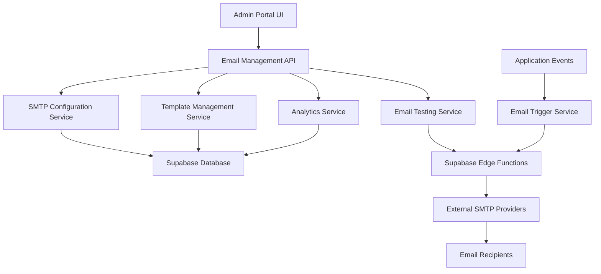

# Admin Email Management System Design

## Overview

The Admin Email Management System provides a centralized interface for administrators to configure, customize, test, and monitor all email communications within the application. The system integrates with the existing admin portal and leverages Supabase for data storage and edge functions for email processing. The design emphasizes security, usability, and seamless integration with existing application workflows.

## Architecture

### High-Level Architecture



### Technology Stack

- **Frontend**: Next.js with TypeScript, React components integrated into existing admin portal
- **Backend**: Supabase Edge Functions for email processing
- **Database**: Supabase PostgreSQL for configuration and logging
- **Email Delivery**: Configurable SMTP providers (Gmail, SendGrid, AWS SES, Custom)
- **Security**: Row Level Security (RLS) policies, encrypted credential storage
- **UI Framework**: Existing component library (shadcn/ui) for consistency

## Components and Interfaces

### 1. SMTP Configuration Component

**Purpose**: Manages email provider settings and connection testing

**Key Features**:
- Provider selection dropdown (Gmail, SendGrid, AWS SES, Custom)
- Dynamic form fields based on provider selection
- Real-time connection testing
- Secure credential encryption before storage

**Interface Design**:
```typescript
interface SMTPConfig {
  id: string;
  provider: 'gmail' | 'sendgrid' | 'aws-ses' | 'custom';
  host: string;
  port: number;
  username: string;
  password: string; // Encrypted in storage
  encryption: 'tls' | 'ssl' | 'none';
  isActive: boolean;
  lastTested: Date;
  testStatus: 'success' | 'failed' | 'pending';
}
```

**Design Rationale**: Separating provider-specific configurations allows for easy extension to new email services while maintaining a consistent interface.

### 2. Email Template Manager

**Purpose**: Provides rich text editing capabilities for email templates with dynamic placeholder support

**Key Features**:
- Rich text editor with HTML support
- Template categorization (welcome, reminder, password reset, etc.)
- Dynamic placeholder insertion and validation
- Real-time preview functionality
- Version history and rollback capability

**Interface Design**:
```typescript
interface EmailTemplate {
  id: string;
  type: 'welcome' | 'lesson_reminder' | 'password_reset' | 'custom';
  name: string;
  subject: string;
  htmlContent: string;
  textContent: string;
  placeholders: string[];
  isActive: boolean;
  version: number;
  createdAt: Date;
  updatedAt: Date;
  createdBy: string;
}

interface TemplatePlaceholder {
  key: string;
  description: string;
  required: boolean;
  dataType: 'string' | 'date' | 'number' | 'boolean';
}
```

**Design Rationale**: Version control ensures administrators can safely experiment with templates and revert if needed. Placeholder validation prevents runtime errors in email generation.

### 3. Email Testing Interface

**Purpose**: Allows administrators to test email delivery and formatting before making templates live

**Key Features**:
- Test email composition with parameter input
- Real-time preview generation
- Test delivery with status tracking
- Error reporting and troubleshooting guidance

**Interface Design**:
```typescript
interface EmailTest {
  id: string;
  templateId: string;
  recipientEmail: string;
  testParameters: Record<string, any>;
  status: 'pending' | 'sent' | 'delivered' | 'failed';
  sentAt: Date;
  deliveredAt?: Date;
  errorMessage?: string;
  previewHtml: string;
}
```

### 4. Email Analytics Dashboard

**Purpose**: Provides comprehensive monitoring and reporting of email system performance

**Key Features**:
- Delivery statistics and trends
- Email log viewing with filtering
- Performance metrics and alerts
- Export functionality for reporting

**Interface Design**:
```typescript
interface EmailAnalytics {
  totalSent: number;
  totalDelivered: number;
  totalFailed: number;
  bounceRate: number;
  deliveryRate: number;
  timeRange: DateRange;
  emailTypeBreakdown: Record<string, number>;
}

interface EmailLog {
  id: string;
  templateType: string;
  recipientEmail: string;
  status: 'sent' | 'delivered' | 'failed' | 'bounced';
  sentAt: Date;
  deliveredAt?: Date;
  errorCode?: string;
  errorMessage?: string;
}
```

## Data Models

### Database Schema

```sql
-- SMTP Configuration Table
CREATE TABLE email_smtp_configs (
  id UUID PRIMARY KEY DEFAULT gen_random_uuid(),
  provider VARCHAR(50) NOT NULL,
  host VARCHAR(255) NOT NULL,
  port INTEGER NOT NULL,
  username VARCHAR(255) NOT NULL,
  password_encrypted TEXT NOT NULL,
  encryption VARCHAR(10) NOT NULL DEFAULT 'tls',
  is_active BOOLEAN DEFAULT false,
  last_tested TIMESTAMP WITH TIME ZONE,
  test_status VARCHAR(20),
  created_at TIMESTAMP WITH TIME ZONE DEFAULT NOW(),
  updated_at TIMESTAMP WITH TIME ZONE DEFAULT NOW()
);

-- Email Templates Table
CREATE TABLE email_templates (
  id UUID PRIMARY KEY DEFAULT gen_random_uuid(),
  type VARCHAR(50) NOT NULL,
  name VARCHAR(255) NOT NULL,
  subject TEXT NOT NULL,
  html_content TEXT NOT NULL,
  text_content TEXT,
  placeholders JSONB DEFAULT '[]',
  is_active BOOLEAN DEFAULT true,
  version INTEGER DEFAULT 1,
  created_at TIMESTAMP WITH TIME ZONE DEFAULT NOW(),
  updated_at TIMESTAMP WITH TIME ZONE DEFAULT NOW(),
  created_by UUID REFERENCES auth.users(id)
);

-- Email Template History Table
CREATE TABLE email_template_history (
  id UUID PRIMARY KEY DEFAULT gen_random_uuid(),
  template_id UUID REFERENCES email_templates(id) ON DELETE CASCADE,
  version INTEGER NOT NULL,
  subject TEXT NOT NULL,
  html_content TEXT NOT NULL,
  text_content TEXT,
  created_at TIMESTAMP WITH TIME ZONE DEFAULT NOW(),
  created_by UUID REFERENCES auth.users(id)
);

-- Email Logs Table
CREATE TABLE email_logs (
  id UUID PRIMARY KEY DEFAULT gen_random_uuid(),
  template_id UUID REFERENCES email_templates(id),
  template_type VARCHAR(50) NOT NULL,
  recipient_email VARCHAR(255) NOT NULL,
  subject TEXT NOT NULL,
  status VARCHAR(20) NOT NULL DEFAULT 'pending',
  sent_at TIMESTAMP WITH TIME ZONE DEFAULT NOW(),
  delivered_at TIMESTAMP WITH TIME ZONE,
  error_code VARCHAR(50),
  error_message TEXT,
  is_test BOOLEAN DEFAULT false,
  metadata JSONB DEFAULT '{}'
);

-- Email Settings Table
CREATE TABLE email_settings (
  id UUID PRIMARY KEY DEFAULT gen_random_uuid(),
  setting_key VARCHAR(100) UNIQUE NOT NULL,
  setting_value JSONB NOT NULL,
  updated_at TIMESTAMP WITH TIME ZONE DEFAULT NOW(),
  updated_by UUID REFERENCES auth.users(id)
);
```

**Design Rationale**: The schema separates concerns while maintaining referential integrity. Encrypted password storage and comprehensive logging support security and compliance requirements.

## Error Handling

### Error Categories and Responses

1. **SMTP Configuration Errors**
   - Invalid credentials: Clear error message with troubleshooting steps
   - Connection timeout: Retry mechanism with exponential backoff
   - Authentication failure: Specific guidance for each provider

2. **Template Validation Errors**
   - Invalid HTML: Syntax highlighting and error location
   - Missing placeholders: List of required placeholders
   - Circular references: Prevention and detection

3. **Email Delivery Errors**
   - Bounce handling: Automatic retry with different templates
   - Rate limiting: Queue management and throttling
   - Provider outages: Fallback SMTP configuration

### Error Recovery Strategies

```typescript
interface ErrorRecoveryConfig {
  maxRetries: number;
  retryDelayMs: number;
  exponentialBackoff: boolean;
  fallbackSMTPConfigId?: string;
  alertThreshold: number;
}
```

## Testing Strategy

### Unit Testing
- SMTP configuration validation
- Template rendering with placeholders
- Email queue processing
- Analytics calculation accuracy

### Integration Testing
- End-to-end email delivery flow
- Template editor functionality
- Admin portal integration
- Database transaction integrity

### Security Testing
- Credential encryption/decryption
- Access control validation
- SQL injection prevention
- XSS protection in templates

### Performance Testing
- Email queue processing under load
- Template rendering performance
- Database query optimization
- Memory usage during bulk operations

## Security Considerations

### Data Protection
- **Credential Encryption**: SMTP passwords encrypted using AES-256 before database storage
- **Access Control**: Row Level Security policies restrict access to admin users only
- **Audit Logging**: All configuration changes logged with user attribution
- **Data Retention**: Configurable purging of old email logs for compliance

### Authentication and Authorization
- **Admin Role Verification**: Integration with existing admin authentication system
- **Permission Granularity**: Separate permissions for configuration, testing, and monitoring
- **Session Management**: Secure session handling for admin operations

### Compliance Features
- **GDPR Compliance**: User data handling in templates follows privacy regulations
- **Unsubscribe Mechanisms**: Automatic inclusion in applicable email types
- **Data Minimization**: Only necessary user data included in email logs

## Integration Points

### Existing Application Integration

1. **User Registration Flow**
   - Automatic welcome email trigger
   - Template selection based on user type
   - Failure handling and retry logic

2. **Lesson Management System**
   - Reminder email scheduling
   - Dynamic content from lesson data
   - User preference respect

3. **Authentication System**
   - Password reset email integration
   - Security token delivery
   - Account verification emails

### API Endpoints

```typescript
// SMTP Configuration
POST /api/admin/email/smtp-config
GET /api/admin/email/smtp-config
PUT /api/admin/email/smtp-config/:id
DELETE /api/admin/email/smtp-config/:id
POST /api/admin/email/smtp-config/:id/test

// Template Management
GET /api/admin/email/templates
POST /api/admin/email/templates
PUT /api/admin/email/templates/:id
DELETE /api/admin/email/templates/:id
GET /api/admin/email/templates/:id/history
POST /api/admin/email/templates/:id/preview

// Email Testing
POST /api/admin/email/test
GET /api/admin/email/test/:id/status

// Analytics
GET /api/admin/email/analytics
GET /api/admin/email/logs
POST /api/admin/email/logs/export
```

## Performance Optimization

### Email Queue Management
- **Batch Processing**: Group emails for efficient delivery
- **Priority Queuing**: Critical emails (password reset) get priority
- **Rate Limiting**: Respect provider limits to avoid throttling
- **Retry Logic**: Intelligent retry with exponential backoff

### Database Optimization
- **Indexing Strategy**: Optimized indexes for common queries
- **Connection Pooling**: Efficient database connection management
- **Query Optimization**: Minimize database calls in email processing
- **Archival Strategy**: Move old logs to archive tables

### Caching Strategy
- **Template Caching**: Cache rendered templates to reduce processing
- **Configuration Caching**: Cache SMTP settings to avoid repeated queries
- **Analytics Caching**: Cache dashboard data with appropriate TTL

This design provides a comprehensive, secure, and scalable solution for email management that integrates seamlessly with the existing application architecture while providing administrators with powerful tools for email communication management.