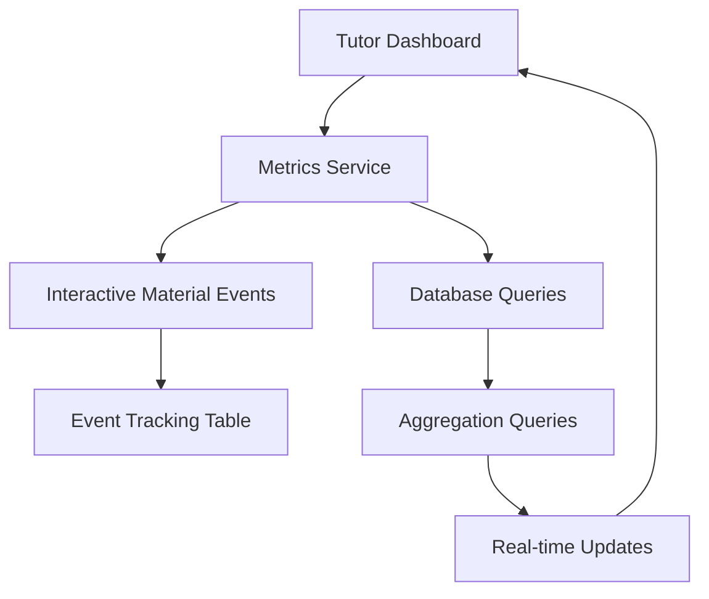

# Dashboard Metrics Improvement - Design Document

## Overview

The dashboard metrics system will be redesigned to accurately track interactive material creation as the primary unit of consumption. This design shifts from tracking traditional "lessons" to tracking each interactive material generation event, providing tutors with precise usage metrics for billing and consumption monitoring.

The system will implement real-time metric updates, historical trend analysis, and auditable tracking to ensure accurate billing and transparent usage monitoring.

## Architecture

### High-Level Architecture



### Data Flow

1. **Event Capture**: Interactive material creation triggers event logging
2. **Metric Calculation**: Real-time aggregation of events for current user
3. **Dashboard Update**: Metrics displayed with historical comparisons
4. **Audit Trail**: All events stored for billing and verification

## Components and Interfaces

### 1. Event Tracking System

**Purpose**: Capture and store interactive material creation events for accurate consumption tracking.

**Design Decision**: Use a dedicated events table rather than modifying existing lesson tables to maintain data integrity and enable precise billing tracking.

#### Interactive Material Events Table
```sql
CREATE TABLE interactive_material_events (
  id UUID PRIMARY KEY DEFAULT gen_random_uuid(),
  tutor_id UUID NOT NULL REFERENCES auth.users(id),
  lesson_id UUID NOT NULL REFERENCES lessons(id),
  sub_topic_id UUID NOT NULL,
  event_type TEXT NOT NULL CHECK (event_type IN ('create', 'recreate')),
  created_at TIMESTAMP WITH TIME ZONE DEFAULT NOW(),
  success BOOLEAN NOT NULL DEFAULT true,
  metadata JSONB
);
```

**Rationale**: Separate events table allows for detailed audit trails and flexible querying without impacting existing lesson data structure.

### 2. Metrics Calculation Service

**Purpose**: Provide real-time calculation of dashboard metrics based on interactive material events.

#### Core Functions
- `getTotalLessonsCount(tutorId)`: Count all successful interactive material events
- `getLessonsThisMonthCount(tutorId)`: Count current month's successful events
- `calculateTrendPercentages(tutorId)`: Compare current vs previous month metrics

**Design Decision**: Calculate metrics in real-time from the database rather than using cached values to ensure accuracy for billing purposes.

**Rationale**: Real-time calculation ensures metrics are always current and auditable, critical for usage-based billing.

### 3. Dashboard Integration Points

#### StatsCard Component Updates
- Modify existing `StatsCard` to accept new metric calculation functions
- Implement real-time updates after interactive material creation
- Add loading states during metric recalculation

#### Interactive Material Creation Hooks
- Integrate event logging into existing material creation workflow
- Ensure metrics update immediately after successful creation
- Handle error states without incrementing counters

## Data Models

### Interactive Material Event Model
```typescript
interface InteractiveMaterialEvent {
  id: string;
  tutorId: string;
  lessonId: string;
  subTopicId: string;
  eventType: 'create' | 'recreate';
  createdAt: Date;
  success: boolean;
  metadata?: {
    materialType?: string;
    generationTime?: number;
    errorDetails?: string;
  };
}
```

### Dashboard Metrics Model
```typescript
interface DashboardMetrics {
  totalLessons: {
    count: number;
    changePercentage: number;
    trend: 'up' | 'down' | 'neutral';
  };
  lessonsThisMonth: {
    count: number;
    changePercentage: number;
    trend: 'up' | 'down' | 'neutral';
  };
  lastUpdated: Date;
}
```

## Error Handling

### Event Logging Failures
- **Strategy**: Implement retry mechanism with exponential backoff
- **Fallback**: Log errors for manual reconciliation if event logging fails
- **User Impact**: Interactive material creation continues even if event logging fails

### Metric Calculation Errors
- **Strategy**: Display cached values with error indicator
- **Fallback**: Show "Unable to load metrics" message with retry option
- **Recovery**: Automatic retry every 30 seconds

### Real-time Update Failures
- **Strategy**: Fall back to manual refresh requirement
- **User Feedback**: Show notification that metrics may be outdated
- **Recovery**: Provide manual refresh button

## Testing Strategy

### Unit Tests
1. **Event Logging Functions**
   - Test successful event creation
   - Test failure handling and cleanup
   - Test different event types (create vs recreate)

2. **Metrics Calculation Functions**
   - Test total count calculations
   - Test monthly count calculations with date boundaries
   - Test percentage change calculations with edge cases

3. **Database Queries**
   - Test query performance with large datasets
   - Test date filtering accuracy
   - Test user isolation (tutors only see their own metrics)

### Integration Tests
1. **End-to-End Material Creation Flow**
   - Create interactive material → verify event logged → verify metrics updated
   - Test failure scenarios → verify no count increment
   - Test recreate scenarios → verify separate event logged

2. **Dashboard Metrics Display**
   - Test real-time updates after material creation
   - Test historical comparison calculations
   - Test multi-user isolation

3. **Performance Tests**
   - Test metric calculation performance with 10,000+ events
   - Test concurrent user metric updates
   - Test database query optimization

### Manual Testing Scenarios
1. **Cross-Month Boundary Testing**
   - Create materials at month end, verify correct month attribution
   - Test month rollover behavior for "This Month" metrics

2. **Multi-User Scenarios**
   - Multiple tutors creating materials simultaneously
   - Verify metric isolation between users

3. **Error Recovery Testing**
   - Simulate database failures during event logging
   - Test recovery and reconciliation procedures

## Implementation Considerations

### Database Performance
- **Indexing Strategy**: Create composite indexes on `(tutor_id, created_at)` and `(tutor_id, success)` for efficient metric queries
- **Query Optimization**: Use date range queries with proper indexing to avoid full table scans

### Real-time Updates
- **Technology Choice**: Use Supabase real-time subscriptions for immediate dashboard updates
- **Fallback Strategy**: Implement polling mechanism if real-time subscriptions fail

### Audit and Compliance
- **Data Retention**: Retain all interactive material events indefinitely for billing audit purposes
- **Data Integrity**: Implement database constraints to prevent duplicate or invalid events
- **Reconciliation**: Provide admin tools to verify metric accuracy against actual usage

### Migration Strategy
- **Backward Compatibility**: Maintain existing lesson counting during transition period
- **Data Migration**: Create initial events for existing interactive materials if historical data is needed
- **Rollback Plan**: Ability to revert to previous metric calculation method if issues arise