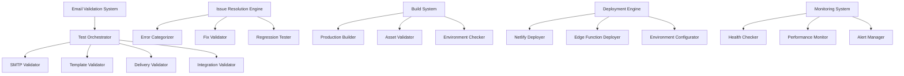

# Email System Validation and Deployment Design

## Overview

This design document outlines a comprehensive end-to-end validation and deployment system for LinguaFlow's email functionality. The system ensures all email features work correctly before and after deployment, provides automated testing capabilities, and includes monitoring and alerting for production environments.

The design follows a multi-phase approach: validation, issue resolution, build preparation, deployment, and post-deployment verification. Each phase includes specific validation checkpoints and rollback capabilities to ensure system reliability.

## Architecture

### High-Level Architecture



### Component Interaction Flow

1. **Validation Phase**: Test orchestrator coordinates all validation components
2. **Issue Resolution**: Error categorizer identifies problems, fix validator confirms resolutions
3. **Build Phase**: Production builder creates optimized artifacts with validation
4. **Deployment Phase**: Deployment engine manages Netlify and Supabase deployments
5. **Monitoring Phase**: Continuous monitoring with automated alerting

## Components and Interfaces

### 1. Email Validation System

#### Test Orchestrator
```typescript
interface TestOrchestrator {
  runFullValidation(): Promise<ValidationResult>
  runSpecificTests(testTypes: TestType[]): Promise<ValidationResult>
  generateValidationReport(): ValidationReport
}

interface ValidationResult {
  passed: boolean
  results: TestResult[]
  summary: ValidationSummary
  timestamp: Date
}
```

**Design Decision**: Centralized orchestrator pattern allows for coordinated testing across all email components while maintaining modularity for individual test types.

#### SMTP Validator
```typescript
interface SMTPValidator {
  validateConnectivity(config: SMTPConfig): Promise<ConnectivityResult>
  validateAuthentication(config: SMTPConfig): Promise<AuthResult>
  testEmailDelivery(config: SMTPConfig, testEmail: TestEmail): Promise<DeliveryResult>
}

interface SMTPConfig {
  host: string
  port: number
  secure: boolean
  auth: SMTPAuth
  provider: EmailProvider
}
```

**Design Rationale**: Separate validation for connectivity, authentication, and delivery allows for granular error identification and targeted fixes.

#### Template Validator
```typescript
interface TemplateValidator {
  validateTemplateRendering(template: EmailTemplate, data: TemplateData): Promise<RenderResult>
  validatePlaceholderSubstitution(template: EmailTemplate): Promise<PlaceholderResult>
  validateTemplateAssets(template: EmailTemplate): Promise<AssetResult>
}

interface EmailTemplate {
  id: string
  type: EmailType
  subject: string
  htmlContent: string
  textContent: string
  placeholders: string[]
}
```

### 2. Issue Resolution Engine

#### Error Categorizer
```typescript
interface ErrorCategorizer {
  categorizeError(error: ValidationError): ErrorCategory
  getSeverityLevel(error: ValidationError): SeverityLevel
  suggestFixes(error: ValidationError): Fix[]
}

enum SeverityLevel {
  CRITICAL = 'critical',
  HIGH = 'high', 
  MEDIUM = 'medium',
  LOW = 'low'
}

enum ErrorCategory {
  SMTP_CONFIG = 'smtp_config',
  TEMPLATE_RENDERING = 'template_rendering',
  DELIVERY_FAILURE = 'delivery_failure',
  AUTHENTICATION = 'authentication',
  ENVIRONMENT = 'environment'
}
```

**Design Decision**: Automated error categorization enables intelligent issue prioritization and prevents deployment of critical issues.

### 3. Build System

#### Production Builder
```typescript
interface ProductionBuilder {
  buildApplication(): Promise<BuildResult>
  validateBuild(): Promise<BuildValidation>
  optimizeAssets(): Promise<OptimizationResult>
  prepareDeploy(): Promise<DeploymentArtifacts>
}

interface BuildResult {
  success: boolean
  artifacts: string[]
  buildTime: number
  warnings: string[]
  errors: string[]
}
```

#### Environment Checker
```typescript
interface EnvironmentChecker {
  validateEnvironmentVariables(): Promise<EnvValidation>
  checkDependencies(): Promise<DependencyCheck>
  validateConfiguration(): Promise<ConfigValidation>
}
```

### 4. Deployment Engine

#### Netlify Deployer
```typescript
interface NetlifyDeployer {
  deployToNetlify(artifacts: DeploymentArtifacts): Promise<DeploymentResult>
  configureEnvironment(envVars: EnvironmentVariables): Promise<ConfigResult>
  validateDeployment(): Promise<DeploymentValidation>
  rollback(previousVersion: string): Promise<RollbackResult>
}
```

#### Edge Function Deployer
```typescript
interface EdgeFunctionDeployer {
  deploySupabaseFunctions(): Promise<FunctionDeployResult>
  validateFunctionEndpoints(): Promise<EndpointValidation>
  testFunctionConnectivity(): Promise<ConnectivityTest>
}
```

### 5. Monitoring System

#### Health Checker
```typescript
interface HealthChecker {
  checkEmailSystemHealth(): Promise<HealthStatus>
  validateCriticalWorkflows(): Promise<WorkflowValidation>
  monitorPerformanceMetrics(): Promise<PerformanceMetrics>
}

interface HealthStatus {
  overall: SystemHealth
  components: ComponentHealth[]
  lastChecked: Date
  issues: HealthIssue[]
}
```

## Data Models

### Validation Models
```typescript
interface ValidationReport {
  id: string
  timestamp: Date
  phase: ValidationPhase
  overallStatus: ValidationStatus
  testResults: TestResult[]
  issues: ValidationIssue[]
  recommendations: string[]
}

interface TestResult {
  testName: string
  category: TestCategory
  status: TestStatus
  duration: number
  details: TestDetails
  errors?: ValidationError[]
}

interface ValidationIssue {
  id: string
  category: ErrorCategory
  severity: SeverityLevel
  description: string
  suggestedFixes: Fix[]
  resolved: boolean
}
```

### Deployment Models
```typescript
interface DeploymentRecord {
  id: string
  version: string
  timestamp: Date
  status: DeploymentStatus
  artifacts: DeploymentArtifacts
  environment: EnvironmentConfig
  validationResults: ValidationResult[]
}

interface MonitoringAlert {
  id: string
  type: AlertType
  severity: AlertSeverity
  message: string
  timestamp: Date
  resolved: boolean
  metadata: AlertMetadata
}
```

## Error Handling

### Error Classification System
1. **Critical Errors**: Block deployment, require immediate resolution
   - SMTP authentication failures
   - Template rendering crashes
   - Build failures
   - Environment variable missing

2. **High Priority**: Should be resolved before deployment
   - Email delivery delays
   - Template formatting issues
   - Performance degradation

3. **Medium Priority**: Can be deployed with monitoring
   - Minor template inconsistencies
   - Non-critical feature issues

4. **Low Priority**: Informational, can be addressed later
   - Optimization opportunities
   - Minor performance improvements

### Error Recovery Strategies
```typescript
interface ErrorRecoveryStrategy {
  retryWithBackoff(operation: () => Promise<any>, maxRetries: number): Promise<any>
  fallbackToAlternative(primary: () => Promise<any>, fallback: () => Promise<any>): Promise<any>
  gracefulDegradation(feature: string, fallback: any): any
}
```

**Design Rationale**: Layered error handling ensures system resilience while maintaining user experience during partial failures.

## Testing Strategy

### Test Categories

#### 1. Unit Tests
- Individual component validation
- SMTP configuration testing
- Template rendering validation
- Error handling verification

#### 2. Integration Tests
- End-to-end email workflows
- Cross-component interactions
- Database integration validation
- API endpoint testing

#### 3. Performance Tests
- Email delivery speed
- Template rendering performance
- System load handling
- Resource utilization monitoring

#### 4. Security Tests
- Authentication validation
- Data encryption verification
- Access control testing
- Input sanitization checks

### Test Automation Framework
```typescript
interface TestSuite {
  emailValidationTests: EmailValidationTest[]
  deploymentTests: DeploymentTest[]
  monitoringTests: MonitoringTest[]
  performanceTests: PerformanceTest[]
}

interface TestExecutor {
  runTestSuite(suite: TestSuite): Promise<TestSuiteResult>
  runContinuousTests(): Promise<void>
  generateTestReport(): TestReport
}
```

### Continuous Validation Pipeline
1. **Pre-deployment**: Full validation suite execution
2. **During deployment**: Real-time monitoring and validation
3. **Post-deployment**: Comprehensive system verification
4. **Continuous**: Ongoing monitoring and health checks

## Deployment Strategy

### Multi-Environment Approach
1. **Development**: Local testing and validation
2. **Staging**: Pre-production validation with production-like data
3. **Production**: Live deployment with monitoring

### Deployment Phases
```typescript
enum DeploymentPhase {
  VALIDATION = 'validation',
  BUILD = 'build', 
  STAGING = 'staging',
  PRODUCTION = 'production',
  VERIFICATION = 'verification'
}

interface DeploymentPipeline {
  executePhase(phase: DeploymentPhase): Promise<PhaseResult>
  validatePhaseCompletion(phase: DeploymentPhase): Promise<boolean>
  rollbackToPhase(phase: DeploymentPhase): Promise<RollbackResult>
}
```

### Blue-Green Deployment Support
- Parallel environment preparation
- Traffic switching capabilities
- Instant rollback mechanisms
- Zero-downtime deployments

**Design Decision**: Blue-green deployment ensures minimal service disruption and provides immediate rollback capabilities if issues are detected.

## Monitoring and Alerting

### Real-time Monitoring
```typescript
interface MonitoringDashboard {
  emailDeliveryMetrics: DeliveryMetrics
  systemHealthStatus: HealthStatus
  performanceIndicators: PerformanceMetrics
  activeAlerts: Alert[]
}

interface AlertingSystem {
  configureAlerts(rules: AlertRule[]): Promise<void>
  sendAlert(alert: Alert): Promise<void>
  escalateAlert(alert: Alert): Promise<void>
  resolveAlert(alertId: string): Promise<void>
}
```

### Key Metrics
1. **Email Delivery Metrics**
   - Delivery success rate
   - Bounce rate
   - Processing time
   - Queue depth

2. **System Performance**
   - Response times
   - Error rates
   - Resource utilization
   - Availability percentage

3. **User Experience**
   - Feature usage
   - Error frequency
   - Performance perception
   - Success workflows

### Automated Diagnostics
```typescript
interface DiagnosticEngine {
  runSystemDiagnostics(): Promise<DiagnosticReport>
  identifyPerformanceBottlenecks(): Promise<BottleneckAnalysis>
  suggestOptimizations(): Promise<OptimizationRecommendations>
}
```

**Design Rationale**: Proactive monitoring with automated diagnostics enables rapid issue identification and resolution before user impact.

## Security Considerations

### Data Protection
- Encrypted email content storage
- Secure credential management
- Access control for admin functions
- Audit logging for all operations

### Compliance Features
- GDPR compliance tools
- Data retention policies
- User consent management
- Privacy controls

### Security Validation
```typescript
interface SecurityValidator {
  validateEncryption(): Promise<EncryptionValidation>
  checkAccessControls(): Promise<AccessControlValidation>
  auditSecurityConfiguration(): Promise<SecurityAudit>
}
```

## Performance Optimization

### Caching Strategy
- Template caching for faster rendering
- Configuration caching to reduce database calls
- Result caching for repeated validations

### Resource Management
```typescript
interface ResourceManager {
  optimizeMemoryUsage(): Promise<void>
  manageConnectionPools(): Promise<void>
  balanceWorkloads(): Promise<void>
}
```

### Scalability Design
- Horizontal scaling capabilities
- Load balancing for high traffic
- Queue management for email processing
- Resource auto-scaling based on demand

**Design Decision**: Performance optimization focuses on user experience while maintaining system reliability and cost efficiency.