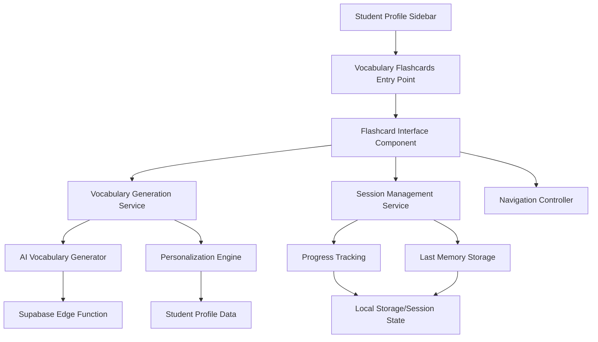

# Vocabulary Flashcards Feature Design

## Overview

The Vocabulary Flashcards feature provides an interactive, gamified vocabulary learning experience integrated into the existing student profile interface. The feature leverages AI-powered vocabulary generation to create personalized, infinite flashcard content that adapts to each student's proficiency level and learning needs. The design emphasizes immersive user experience with comprehensive word information and seamless navigation.

## Architecture

### High-Level Architecture



### Component Hierarchy

- **VocabularyFlashcardsTab**: Main container component
  - **FlashcardInterface**: Core flashcard display and interaction
    - **VocabularyCard**: Individual flashcard component
    - **NavigationControls**: Forward/backward navigation
    - **ExitControls**: Return to profile interface
  - **SessionManager**: Handles session state and memory
  - **VocabularyService**: Manages word generation and personalization

## Components and Interfaces

### 1. Sidebar Integration

**Component**: `VocabularyFlashcardsTab`
- **Location**: Added to student profile sidebar navigation
- **Integration**: Follows existing sidebar pattern used by Discussion Topics
- **State Management**: Utilizes existing student profile context

**Design Decision**: Integrate as a new tab in the existing student profile structure to maintain consistency with the current UI patterns and leverage existing student context.

### 2. Flashcard Interface

**Component**: `FlashcardInterface`
- **Layout**: Full-screen overlay with background blur for immersion
- **Animation**: Smooth transitions between cards using CSS transforms
- **Responsive**: Adapts to different screen sizes while maintaining readability

**Key Features**:
- Immersive full-screen experience with blurred background
- Card-flip animations for engaging transitions
- Touch/swipe support for mobile devices
- Keyboard navigation support (arrow keys)

**Design Decision**: Use a full-screen overlay approach to create focus and eliminate distractions, similar to modern flashcard applications like Anki or Quizlet.

### 3. Vocabulary Card Component

**Component**: `VocabularyCard`

**Structure**:
```typescript
interface VocabularyCardData {
  word: string;
  pronunciation: string;
  partOfSpeech: string;
  definition: string;
  exampleSentences: {
    present: string;
    past: string;
    future: string;
    presentPerfect: string;
    pastPerfect: string;
    futurePerfect: string;
  };
}
```

**Layout Design**:
- **Header**: Word + Pronunciation (phonetic notation)
- **Body**: Definition + Part of Speech
- **Footer**: Expandable example sentences organized by tense
- **Highlighting**: Bold formatting for target word in sentences

**Design Decision**: Organize information hierarchically with the word as the primary focus, followed by essential information (definition, part of speech) and detailed examples that can be expanded to avoid overwhelming the interface.

### 4. Navigation System

**Component**: `NavigationControls`

**Features**:
- Previous/Next arrow buttons
- Progress indicator (current position in session)
- "Continue from last memory" option on session start
- Smooth transitions with loading states

**Design Decision**: Implement bidirectional navigation to allow review of previous words, with visual feedback and progress tracking to maintain user orientation.

## Data Models

### 1. Student Vocabulary Profile

```typescript
interface StudentVocabularyProfile {
  studentId: string;
  proficiencyLevel: 'A1' | 'A2' | 'B1' | 'B2' | 'C1' | 'C2';
  nativeLanguage: string;
  learningGoals: string[];
  vocabularyWeaknesses: string[];
  conversationalBarriers: string[];
  lastSessionPosition?: number;
  seenWords: string[];
}
```

### 2. Vocabulary Session

```typescript
interface VocabularySession {
  sessionId: string;
  studentId: string;
  startTime: Date;
  currentPosition: number;
  words: VocabularyCardData[];
  isActive: boolean;
}
```

### 3. Vocabulary Generation Request

```typescript
interface VocabularyGenerationRequest {
  studentProfile: StudentVocabularyProfile;
  excludeWords: string[];
  count: number;
  difficulty?: string;
  focusAreas?: string[];
}
```

## Vocabulary Generation Service

### AI-Powered Word Selection

**Service**: `VocabularyGenerationService`

**Personalization Algorithm**:
1. **Proficiency Analysis**: Select words appropriate for student's CEFR level
2. **Native Language Consideration**: Avoid false friends and cognates when beneficial
3. **Goal Alignment**: Prioritize vocabulary that supports stated learning objectives
4. **Weakness Targeting**: Focus on areas identified as challenging
5. **Barrier Addressing**: Select words that help overcome conversational obstacles

**Implementation Approach**:
- Supabase Edge Function for AI-powered vocabulary generation
- Integration with existing AI infrastructure (similar to discussion questions)
- Caching mechanism to reduce API calls and improve performance

**Design Decision**: Leverage existing AI infrastructure and patterns established in the discussion topics feature to ensure consistency and maintainability.

### Non-Repetition Strategy

**Approach**: 
- Track seen words in session state and student profile
- Implement intelligent word selection that builds upon previous vocabulary
- Use semantic similarity to introduce related words progressively

## Session Management

### Last Memory Functionality

**Implementation**:
- Store session state in localStorage for immediate access
- Persist critical data to database for cross-device continuity
- Provide "Continue from last memory" option on session start

**Data Persistence**:
- **Local Storage**: Current session state, temporary progress
- **Database**: Long-term progress, seen words, session history

**Design Decision**: Use hybrid storage approach to balance performance (local storage) with persistence (database) and cross-device functionality.

### Progress Tracking

**Metrics Tracked**:
- Words seen in current session
- Session duration
- Navigation patterns (forward/backward usage)
- Exit points and return patterns

## Error Handling

### Vocabulary Generation Failures

**Scenarios**:
- AI service unavailable
- Network connectivity issues
- Invalid student profile data

**Fallback Strategy**:
- Cached vocabulary sets for offline functionality
- Graceful degradation with simplified word information
- Clear error messaging with retry options

### Session Recovery

**Approach**:
- Automatic session state recovery on page refresh
- Graceful handling of corrupted session data
- Fallback to new session if recovery fails

## Testing Strategy

### Unit Testing

**Components to Test**:
- `VocabularyCard` rendering and data display
- `NavigationControls` interaction handling
- `VocabularyGenerationService` personalization logic
- Session state management functions

### Integration Testing

**Scenarios**:
- End-to-end flashcard navigation flow
- Vocabulary generation and display pipeline
- Session persistence and recovery
- Student profile integration

### Performance Testing

**Focus Areas**:
- Flashcard transition animations
- Large vocabulary set handling
- Memory usage with extended sessions
- AI service response times

**Design Decision**: Follow established testing patterns from the discussion topics feature to ensure consistency and leverage existing test infrastructure.

## Security Considerations

### Data Privacy

**Student Data Protection**:
- Vocabulary preferences stored securely
- Session data encrypted in transit
- Minimal data retention policy for seen words

### AI Service Security

**API Protection**:
- Rate limiting for vocabulary generation requests
- Input validation for student profile data
- Secure API key management for AI services

## Performance Optimization

### Rendering Optimization

**Strategies**:
- React.memo for vocabulary cards to prevent unnecessary re-renders
- Virtualization for large vocabulary sets (if needed)
- Lazy loading of example sentences
- Optimized animations using CSS transforms

### Data Loading

**Approaches**:
- Prefetch next vocabulary words during current card display
- Implement vocabulary caching strategy
- Batch vocabulary generation requests
- Progressive loading of detailed word information

**Design Decision**: Apply performance optimization patterns established in the discussion topics feature, including React.memo usage and efficient state management.

## Accessibility

### Keyboard Navigation

**Support**:
- Arrow keys for flashcard navigation
- Escape key to exit flashcard mode
- Tab navigation for interactive elements
- Screen reader compatibility

### Visual Accessibility

**Features**:
- High contrast mode support
- Scalable text for pronunciation guides
- Clear visual hierarchy
- Focus indicators for navigation elements

## Integration Points

### Existing System Integration

**Student Profile System**:
- Leverage existing student context and data
- Follow established sidebar navigation patterns
- Integrate with existing authentication and authorization

**UI Component Library**:
- Use existing UI components where applicable
- Follow established design system patterns
- Maintain visual consistency with current interface

**Database Integration**:
- Extend existing student profile schema
- Use established database patterns and migrations
- Leverage existing Supabase infrastructure

**Design Decision**: Maximize reuse of existing infrastructure and patterns to ensure consistency, reduce development time, and maintain system coherence.