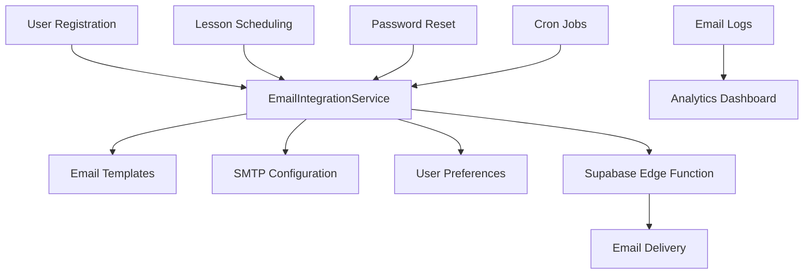

# Email System Integration

This document describes how the email management system integrates with existing application features to provide seamless email functionality.

## Overview

The email integration system connects the centralized email management system with existing application workflows, including:

- User registration (welcome emails)
- Lesson scheduling (reminder emails)  
- Password reset (security emails)
- User notification preferences

## Architecture



## Integration Points

### 1. User Registration Flow

**File**: `lib/auth-context.tsx`

When a user signs up, the system automatically sends a welcome email:

```typescript
// Send welcome email using integrated email system
await EmailIntegrationService.sendWelcomeEmail(email, {
  firstName: tutorData?.first_name,
  lastName: tutorData?.last_name,
  userId: tutorData?.id
});
```

**Features**:
- Uses configured SMTP settings
- Applies active welcome email template
- Respects user notification preferences
- Logs email delivery for analytics

### 2. Password Reset Flow

**Files**: 
- `app/api/auth/reset-password/route.ts`
- `app/auth/forgot-password/page.tsx`

Custom password reset implementation that uses the email management system:

```typescript
// Generate secure reset token
const resetToken = randomBytes(32).toString('hex');

// Send password reset email
await EmailIntegrationService.sendPasswordResetEmail(email, {
  userName: user.first_name || 'User',
  resetUrl: resetUrl,
  expiryTime: '1 hour'
});
```

**Features**:
- Secure token generation and storage
- Custom email templates
- Configurable expiry times
- Audit logging

### 3. Lesson Reminder System

**Files**:
- `supabase/functions/schedule-lesson-reminders/index.ts`
- `app/api/admin/email/schedule-reminders/route.ts`

Automated system that sends lesson reminders based on calendar events:

```typescript
// Schedule lesson reminders for upcoming lessons
const result = await EmailIntegrationService.scheduleLessonReminders();
```

**Features**:
- Automated scheduling via cron jobs
- Configurable reminder timing
- User preference respect
- Duplicate prevention

### 4. User Notification Preferences

**Files**:
- `app/api/user/notification-preferences/route.ts`
- `components/settings/NotificationPreferences.tsx`

Users can control which emails they receive:

```typescript
interface UserNotificationPreferences {
  welcomeEmails: boolean;
  lessonReminders: boolean;
  passwordResetEmails: boolean;
  customEmails: boolean;
  reminderTimingMinutes: number;
}
```

## Database Schema

### Core Tables

1. **email_smtp_configs** - SMTP provider configurations
2. **email_templates** - Customizable email templates
3. **email_logs** - Delivery tracking and analytics
4. **password_reset_tokens** - Secure password reset tokens
5. **user_notification_preferences** - User email preferences

### Key Relationships

```sql
-- User preferences linked to tutors
user_notification_preferences.user_id → tutors.id

-- Email logs track template usage
email_logs.template_id → email_templates.id

-- Password reset tokens linked to users
password_reset_tokens.user_id → tutors.id
```

## Automated Scheduling

### Cron Jobs

The system uses PostgreSQL's `pg_cron` extension for automated tasks:

1. **Lesson Generation**: Every 15 minutes
   ```sql
   SELECT cron.schedule('automated-lesson-generation', '*/15 * * * *', ...);
   ```

2. **Lesson Reminders**: Every 5 minutes
   ```sql
   SELECT cron.schedule('automated-lesson-reminders', '*/5 * * * *', ...);
   ```

### Edge Functions

- `send-integrated-email`: Handles email delivery
- `schedule-lesson-reminders`: Processes reminder scheduling

## Configuration

### Environment Variables

```bash
# Email system
SUPPORT_EMAIL=support@linguaflow.com
CRON_SECRET=your-cron-secret-key

# Supabase (existing)
NEXT_PUBLIC_SUPABASE_URL=your-supabase-url
SUPABASE_SERVICE_ROLE_KEY=your-service-role-key
```

### Default Settings

The system creates default configurations on deployment:

- **Lesson reminder timing**: 15 minutes before lesson
- **Default templates**: Welcome, lesson reminder, password reset
- **User preferences**: All emails enabled by default

## Testing

### Integration Tests

Run the email integration test suite:

```bash
npm test __tests__/integration/email-integration.test.ts
```

### Manual Testing

Use the test script to verify system health:

```bash
node scripts/test-email-integration.js
```

### Admin Testing

Access the admin portal to:
1. Configure SMTP settings
2. Customize email templates
3. Send test emails
4. View analytics

## Error Handling

### Retry Logic

The system implements retry logic for failed email deliveries:

- **Max retries**: 3 attempts
- **Backoff**: Exponential (5min, 10min, 20min)
- **Fallback**: Alternative SMTP configuration

### Monitoring

Email delivery is monitored through:

- **Email logs**: Track all delivery attempts
- **Analytics dashboard**: View success/failure rates
- **Admin alerts**: Notify on high failure rates

## Security

### Data Protection

- **SMTP passwords**: Encrypted before database storage
- **Reset tokens**: SHA-256 hashed, time-limited
- **User data**: GDPR compliant handling

### Access Control

- **Admin functions**: Require admin role verification
- **User preferences**: Users can only modify their own
- **Email logs**: Admin-only access for privacy

## Troubleshooting

### Common Issues

1. **No emails being sent**
   - Check SMTP configuration in admin portal
   - Verify email templates are active
   - Check email logs for error messages

2. **Lesson reminders not working**
   - Verify cron jobs are active: `SELECT * FROM cron_job_status;`
   - Check calendar events have correct status
   - Verify user notification preferences

3. **Password reset not working**
   - Check password reset template exists
   - Verify token expiry settings
   - Check email delivery logs

### Debug Commands

```sql
-- Check cron job status
SELECT * FROM cron_job_status;

-- View recent email logs
SELECT * FROM email_logs ORDER BY sent_at DESC LIMIT 10;

-- Check active templates
SELECT type, name, is_active FROM email_templates;

-- View SMTP configurations
SELECT provider, host, is_active FROM email_smtp_configs;
```

## Future Enhancements

### Planned Features

1. **Email scheduling**: Send emails at specific times
2. **A/B testing**: Test different email templates
3. **Personalization**: Dynamic content based on user data
4. **Webhooks**: Real-time delivery status updates
5. **Bulk operations**: Send emails to multiple users

### Performance Optimizations

1. **Queue management**: Batch email processing
2. **Template caching**: Reduce database queries
3. **Connection pooling**: Optimize SMTP connections
4. **Rate limiting**: Respect provider limits

## Support

For issues or questions about the email integration system:

1. Check the troubleshooting section above
2. Review email logs in the admin portal
3. Run the test script for system health check
4. Contact the development team with specific error messages